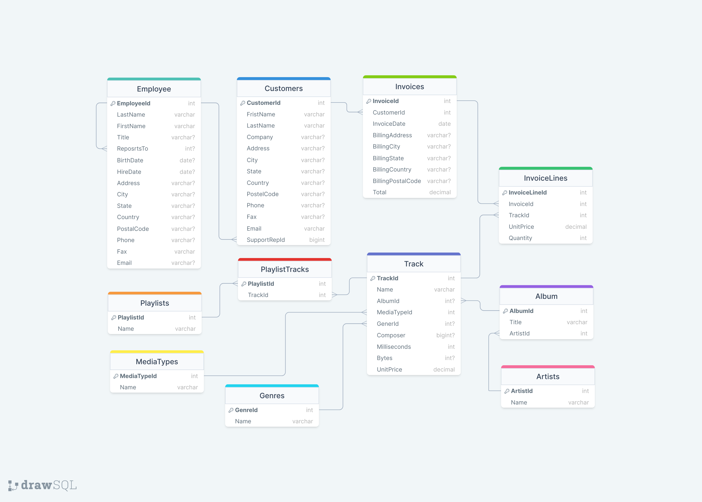

# Get Started With Entity Framework

A simple console application to get started with Entity Framework

# Requirements

- dotnet NET 7.0 SDK or later
- Entity Framework

To work with Entity framework from Visual Studio 

```
Install-Package Microsoft.EntityFrameworkCore.Tools
```

To work with Entity framework from cli

```
dotnet tool install --global dotnet-ef
dotnet add package Microsoft.EntityFrameworkCore.Design
```
---

## The database diagram that used in the application



---
## Run locally

1. Clone

```bash
git clone https://github.com/ma7m00dma7m00d/GetStartedWithEF.git
```

2. Go the project directory

```
cd GetStartedWithEF
```

3. Get all the packages

```
dotnet restore
```

4. Run the application

```
dotnet run
```
